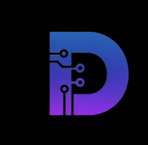
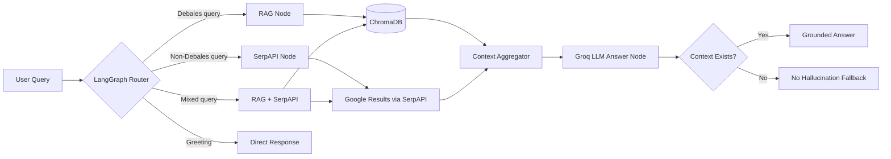
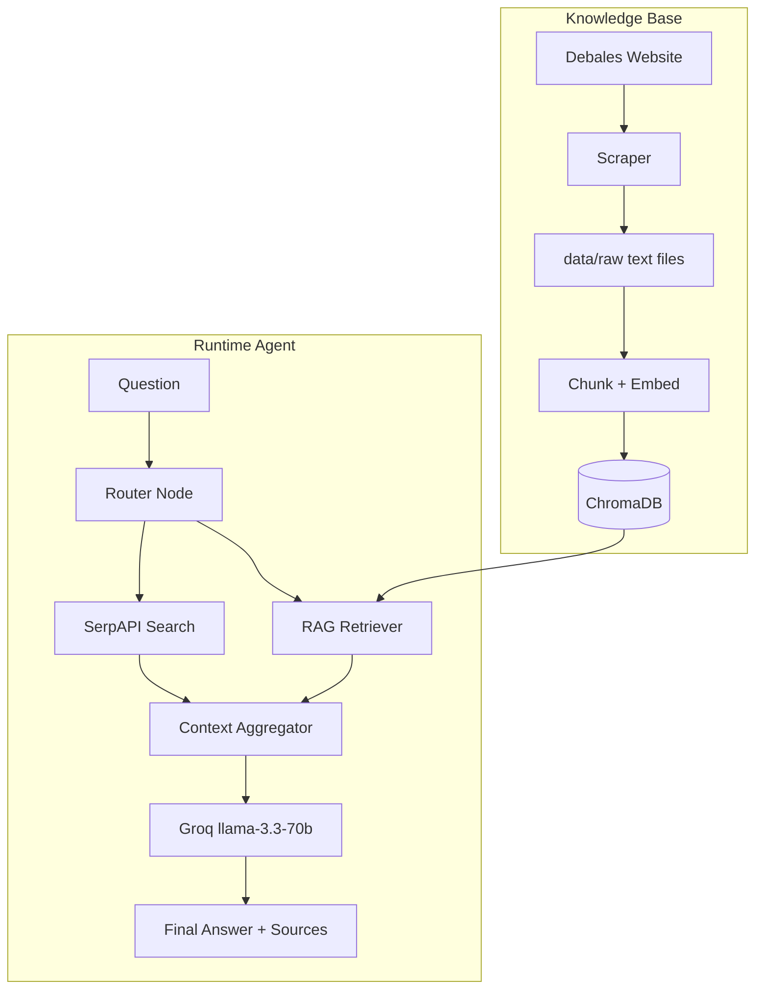
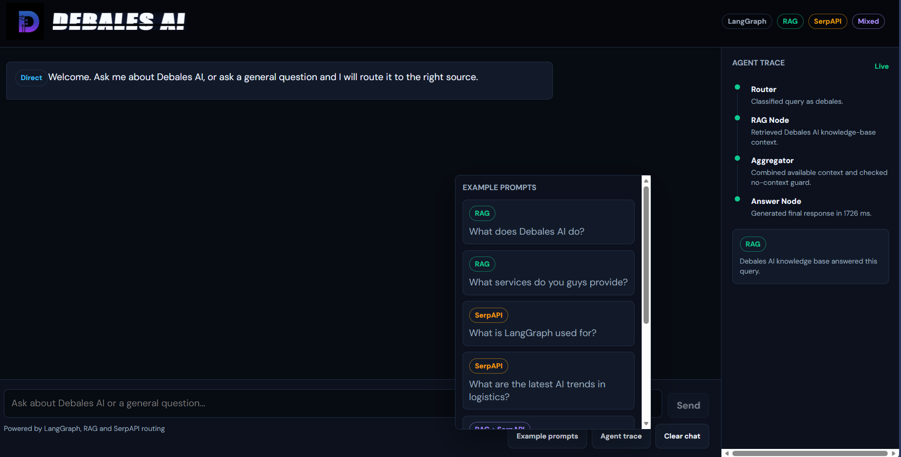

<div align="center">
  

  <h1>Debales AI Assistant</h1>

  <p>
    A LangGraph-powered chatbot for Debales AI that routes every query to the right source:
    Debales RAG, SerpAPI web search, both, or a no-hallucination fallback.
    Imagine a receptionist at a company. This assistant works in the same way.
    If you ask about the company, it checks internal documents.
    If you ask something general, it searches the internet.
    If it's both, it tries to check both places.
    And if they don’t know, it honestly says so instead of guessing.
  </p>

  <p>
    
    
    
    
    
    
    <a href="https://github.com/anishsmit23">
      
    </a>
    <a href="https://www.linkedin.com/in/anish55/">
      
    </a>
  </p>
</div>

---

## Overview

Debales AI Assistant is a company-centered chatbot built for Debales AI. It understands company-relative language like "you guys", "your services", and "what do you provide" as Debales AI questions.

The assistant follows four strict routing rules:

| Query Type | Route | Source |
|---|---|---|
| Debales AI questions | `RAG` | Local Debales knowledge base |
| Non-Debales questions | `SerpAPI` | External web search |
| Mixed/current Debales questions | `RAG + SerpAPI` | Both sources |
| Unknown/no-context questions | `No Context` | No hallucination fallback |

## Visual Workflow



## Architecture



## UI Preview

The Flask web UI displays the route used on every assistant response.

<div align="center">
  
  <p><em>Connected chatbot UI with route badges, example prompts, and live agent trace.</em></p>
</div>

| UI Element | Purpose |
|---|---|
| Header logo | Debales AI brand identity |
| Example prompts button | Demo RAG, SerpAPI, and mixed routing quickly |
| Chat panel | User and assistant messages |
| Route badge | Shows `RAG`, `SerpAPI`, `RAG + SerpAPI`, or `No Context` |
| Context box | Shows retrieved chunks, web snippets, or source URLs |
| Agent trace panel | Shows router, RAG, SerpAPI, aggregator, and answer steps |

## Tech Stack

| Layer | Tool |
|---|---|
| Agent workflow | LangGraph |
| LLM | Groq `llama-3.3-70b-versatile` |
| Embeddings | `sentence-transformers` / Hugging Face embeddings |
| Vector database | ChromaDB |
| Web search | SerpAPI |
| Scraping | Requests + BeautifulSoup |
| Backend API | Flask |
| Frontend | Single-page HTML/CSS/JavaScript |
| Testing | Pytest |

## Setup

1) Create and activate a virtual environment

```bash
python -m venv .venv
.venv\Scripts\activate
```

2) Install dependencies

```bash
pip install -r requirements.txt
```

3) Create your `.env`

```bash
copy .env.example .env
```

4) Add your keys to `.env`

```env
GROQ_API_KEY=your_groq_api_key_here
SERPAPI_API_KEY=your_serpapi_key_here
```

Optional values:

```env
GROQ_MODEL=llama-3.3-70b-versatile
GROQ_TEMPERATURE=0
USE_LLM_ROUTER=false
RAG_TOP_K=4
WEB_SEARCH_MAX_RESULTS=5
SERPAPI_ENGINE=google
SERPAPI_LOCATION=
SERPAPI_TIMEOUT=20
DEBALES_START_URLS=https://debales.ai/,https://debales.ai/blog,https://debales.ai/integrations
SCRAPER_MAX_PAGES=80
SCRAPER_DELAY_SECONDS=0.5
RAW_DIR=data/raw
CHROMA_DIR=chroma_db
CHROMA_COLLECTION=debales_ai_knowledge
EMBEDDING_MODEL=all-MiniLM-L6-v2
HF_TOKEN=
```

## Build The Knowledge Base

Scrape Debales AI pages:

```bash
python -m scraper.scrape
```

Ingest scraped content into ChromaDB:

```bash
python -m rag.ingest
```

This creates:

```text
data/raw/
chroma_db/
```

## Run

CLI chatbot:

```bash
python main.py
```

Web UI:

```bash
python web_app.py
```

Open:

```text
http://127.0.0.1:5000
```

## Tests

Run all tests:

```bash
pytest
```

Run a single test file:

```bash
pytest tests/test_router.py
pytest tests/test_serp_tool.py
pytest tests/test_conversation.py
pytest tests/test_web_app.py
```

## Project Structure

```text
agent/
  graph.py              LangGraph workflow (nodes + edges)
  nodes.py              Router, RAG, SerpAPI, aggregator, answer nodes
  prompts.py            System and router prompts
  state.py              Agent state schema

rag/
  ingest.py             Chunk + embed + store Debales content
  retriever.py          Chroma retrieval with raw-text fallback
  embeddings.py         Hugging Face embeddings
  vectorstore.py        Chroma wrapper

scraper/
  scrape.py             Debales website scraper

tools/
  serp_tool.py          SerpAPI search wrapper

templates/
  chat.html             Web UI template

static/
  debales-logo.png      Header logo
  ui-preview.png        README UI preview screenshot

tests/
  conftest.py           Pytest fixtures
  test_router.py        Router behavior tests
  test_serp_tool.py     SerpAPI wrapper tests
  test_conversation.py  End-to-end conversation route tests
  test_web_app.py       Flask API contract tests

main.py                 CLI entry point
web_app.py              Flask web app
settings.py             Environment helpers
requirements.txt        Python dependencies
```

## No-Hallucination Guard

The answer node never generates a grounded answer without context.

If RAG and SerpAPI both return no usable context, the assistant returns:

```text
I don't have enough information to answer that based on available sources.
```

## Demo Prompts

| Demo Goal | Prompt |
|---|---|
| RAG | `What services do you guys provide?` |
| RAG | `What does Debales AI do?` |
| SerpAPI | `What is LangGraph used for?` |
| SerpAPI | `What are the latest AI trends in logistics?` |
| Mixed | `Compare Debales AI with current logistics automation tools.` |
| Mixed | `How does Debales AI fit into the 2026 freight tech market?` |

---

<div align="center">
  <h3>Made by Anish</h3>
  <p>Created for <strong>Debales AI</strong></p>
  <p>
    <a href="https://github.com/anishsmit23">GitHub</a>
    &nbsp;|&nbsp;
    <a href="https://www.linkedin.com/in/anish55/">LinkedIn</a>
  </p>
</div>
